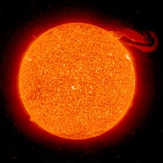

#Soleil

Le Soleil est l’étoile du Système solaire.

## Caractéristiques

-Diamètre moyen3 	1 392 684 km
-Rayon équatorial3 	696 342 km
-Circonférence équatoriale4 	4,379 × 106 km
-Aplatissement aux pôles 	9×10-6
-Surface4 	6,087 7 × 1012 km2
-Volume4 	1,412 × 1018 km3
-Masse (M☉)5 	1,989 1 × 1030 kg
-Masse volumique 	
	- moyenne4 	1 408 kg m−3
	- au centre 	150 000 kg m−3
-Gravité à la surface 	273,95 m s−2
-Vitesse de libération6 	617,54 km/s
-Température 	
	- au centre 	15,1 MK
	- à la surface7 	entre 3 500 °C et 5 900 °C
	- couronne7,8 	1 000 000 °C
-Flux énergétique 	3,826 × 1026 W
-Type spectral5 	G2 V
-Métallicité9 	Z = 0.0122
- Symbole : ;

